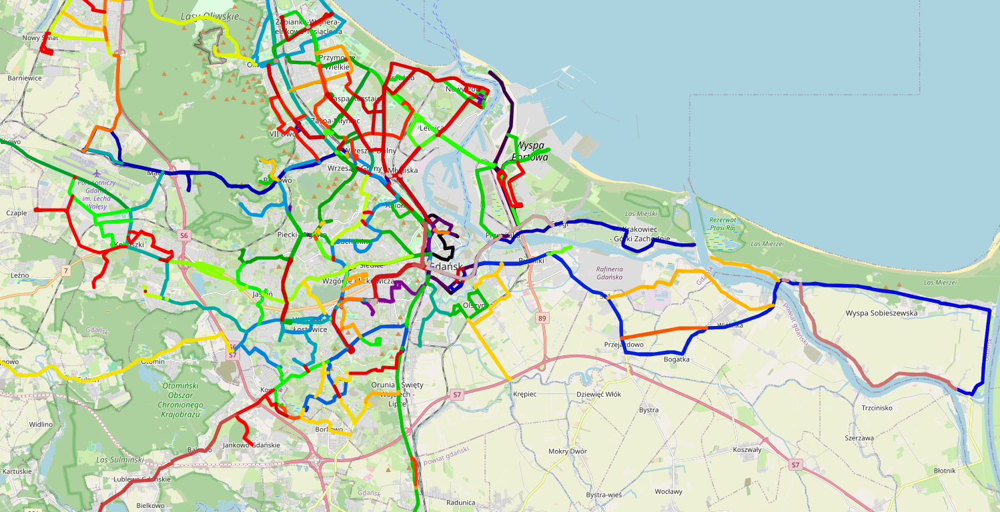

# GTFS & GPS Data Processing for Public Transport

## Overview
This project processes GTFS and GTFS-RT data to prepare raw datasets and initially process GPS readings for better usability (e.g., for bus delay prediction in other projects). It includes bus network segmentation, fast GPS data processing algorithm, and visualization tools to analyze bus movements and delays.

The project is divided into two main components ('GTFS processing.ipynb' and 'gps processing algorithm.ipynb'):
1. **GTFS Data Processing** - Constructs new data frames for further use, preparing data for the algorithm in the second part of the project. Processing bus stops, route shapes, and segmenting bus network for efficient pathfinding.
2. **GPS Data Processing** - Matches real-time GPS data to the GTFS-based network to track vehicle positions, estimate arrival times, and analyze delays.

Each notebook is well-described for better understanding.

## Features
- Processes GTFS data, including bus stops, arrivals, and schedules to create more comfortable data frames.
- Generates segmentation of the transit network.
- Implements a real-time GPS tracking system that estimates bus positions (mapping to segments using a fast k-d tree.) and delays.
- Provides an interactive visualization of routes and GPS-tracked vehicles.
- Possibility of using the algorithm to create models predicting bus delays.
  
## Usage
- Download the required data. Some files might be stored as pointers (.lfs).
- Open the Jupyter Notebooks (first analyze 'GTFS processing.ipynb' and then 'gps processing algorithm.ipynb').
- Install the required libraries (you will find them in the first cells).
- Execute the cells step by step to process the data.
- In the second notebook, you can modify the tracked trip_id to visualize different routes and verify the correctness of the algorithm. 
- You can find the results (map visualizations and new processed data frames) in the results folder.

## Dependencies
The project requires the following Python libraries:
- pandas
- numpy
- folium
- matplotlib
- shapely
- joblib

Ensure that all dependencies are installed before running the notebooks.

## Data
The dataset includes:
- Raw minimalist GTFS data for Gdańsk from a specific period (.txt format)
- GTFS-RT data ('GTFS-RT data.csv') for specific period, which contains gps readings in Gdansk area.

## Examples
Below, visualization of the division of the bus network into shared segments (left) and processed GPS readings with obtained information characterizing the trip (right):
 

    
    

## Future Improvements
- Improvement of the GPS data processing algorithm – accounting for more edge cases.
- Implementation of an algorithm for calculating travel times for individual segments.
- Adapting the project for real-time processing, which can be used in a future mobile application.
- Expanding the approach to other cities beyond Gdańsk.

